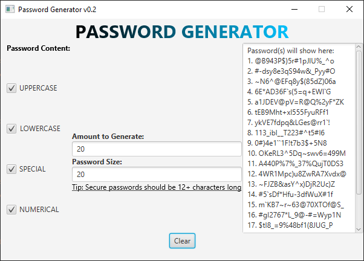

# Password Generator


This is a simple **Password Generator Desktop Application** made with JavaFX.

# Goal:
To build a password generator to assist users in randomly constructing strings that they may want to use for their passwords.
Along side this program, a simple ***User Interface*** featuring options to customize the string generation. 

# Features:

  - Four different character sets to pick from and make a password. Including:
  ``` 
(A-Z) Uppercase 
(a-z) Lowercase
( `~!@#$%^&*()-+= ) Special Characters
(0-9) Numerical
```
  - Password Generation Amount (Default set to 5)
  - Password Length Assignment (Default set to 12)
  - Simple ***User Interface*** featuring a text area outputing all generated passwords (Clipboard friendly - copyable)
  


# Future Goals for Additions: 
- [x] Add Text Field to specify Password Length
- [ ] Addition of a new **Custom Option** where the User defines the character set that should be used for password generation.
- [x] Remove ability for users to write in *Password Display*
- [x] A way for users to save their generated passwords to a file
